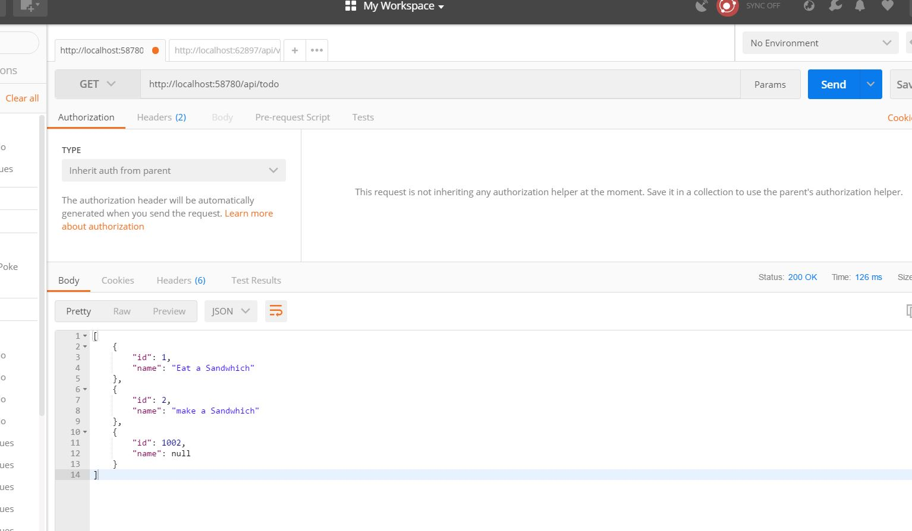

## To-Do API part 2
This application allows users to interaction using post Postman, The API has a build in database with CRUD methods, GET, SET methods.

## Author:
Tiger Hsu

## Version:
2.0.0 

## Overview
Two Controllers for two diffrenet CRUD operations. One controller has the List controllers, and the other has the to-do items.
[GET] -> adding to items to the todoLists
[PUT] -> method adding to these items.
[Delte] -> finds items by Id, if found performs remove function.

These are just primarly endpoints need postman to perform the end action in order to see JSON return.

## Getting Started
1. Clone the repository to your local machine.
2. Select into application directory where the *AppName.sln* exist.
3. Open the application using *Open/Start AppName.sln*.
5. The website will run on your default web browser routing to the main home page.

## Example

## Architecture
 - C# ASP.NET Core application.
 - MVC architectural design pattern.
 - Entity Framework - built in Visual Studio

## Attribution
Josh Taylor

## Resources
StackoverFlow
Microsoft Docs

## License
MIT License

## Change Log

04-22-2018 4:59pm -
